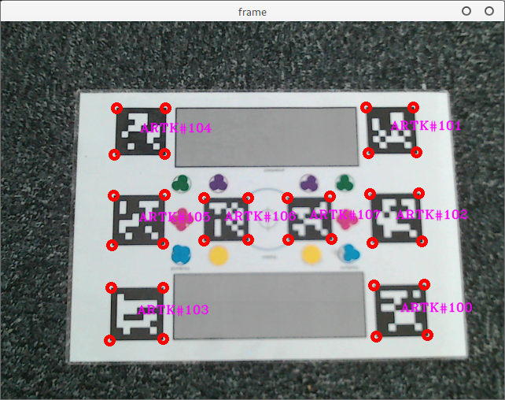

<<<<<<< HEAD
# Markers detection

Collection of **C++** programs for markers detection using ARToolKitPlus and Chilitags libraries.

## Getting Started

### Prerequisites

To get started, you need to build and install the following libraries:

- [CMake](https://cmake.org/)
- [cxxopts](https://github.com/jarro2783/cxxopts) (used to manage command line options)
- [ARToolKitPlus 2.3.1](https://launchpad.net/artoolkitplus)
- [Chilitags](https://github.com/chili-epfl/chilitags)
- [OpenCV](https://opencv.org/) (for Chilitags)
- [Hiredis](https://github.com/redis/hiredis) **/!\ Optional**
- [RedisImageHelper](https://forge.pole-aquinetic.net/nectar-platform/redis-camera) **/!\ Optional**
- [RapidJSON](http://rapidjson.org/) **/!\ Optional** (used in redis version to send/retrieve markers data).
- A fairly recent **C++** compiler

### Compiling

Go into project folder and run the following:
```
mkdir build
cd build
cmake ..
make -j
```

## Running the tests
Once compiled, if you have all the dependencies install you should have 4 executalbes.

**singlemarker-detection**: Find at most one ARToolKitPlus marker on a given image. If multiple markers are present it returns the one with the most confidence.

```
singlemarker-detection [OPTION...]

  -d, --debug                   Enable debug mode. This will print helpfull
                                informations on the standard error stream.
  -c, --camera-calibration arg  The camera calibration file that will be
                                used to adjust the results depending on 
                                the physical camera characteristics.
  -i, --in-file arg             The image file to detect marker on.
  -h, --help                    Print this help message.
```

**multimarker-detection**: Find ARToolKitPlus markers on a given image.
```
multimarker-detection [OPTION...]

  -d, --debug                   Enable debug mode. This will print helpfull
                                process informations on the standard error
                                stream.
  -c, --camera-calibration arg  The camera calibration file that will be used
                                to adjust the results depending on the
                                physical camera characteristics.
  -i, --in-file arg             The image file to detect marker on.
  -h, --help                    Print this help message.
```

**markers-detection-server (optional)**: Find ARToolKitPlus and Chilitags markers and send detection results into a running redis server as json.
```
markers-detection-server [OPTION...]

  -d, --debug                   Enable debug mode. This will print helpfull
                                process informations on the standard error
                                stream.
  -c, --camera-calibration arg  The camera calibration file that will be used
                                to adjust the results depending on the
                                physical camera characteristics.
  -k, --key arg                 The redis key to fetch data from and put data
                                on.
  -h, --help                    Print this help message.
```

**markers-detection-client (optional)**: Get json marker informations from redis, parse them and display the result as an image using **OpenCV**.
```
markers-detection-client [OPTION...]

  -d, --debug    Enable debug mode. This will print helpfull process
                 informations on the standard error stream.
  -k, --key arg  The redis key to fetch and put data on
  -h, --help     Print help
```

## Example

The following commands (with a redis server up and running)
```
./markers-detection-server -d -c ../data/no_calibration.cal -k custom:image
./markers-detection-client -d -k custom:image
```
gives the following output:

=======

## Requirements

### ARtoolkitPlus download:

[https://launchpad.net/artoolkitplus/+download](https://launchpad.net/artoolkitplus/trunk/2.3.1/+download/ARToolKitPlus-2.3.1.tar.bz2)

Build with CMake ok. 

### Chilitags download:

https://github.com/chili-epfl/chilitags/releases

Build with CMake not ok. 
>>>>>>> acdafb9... First readme.
